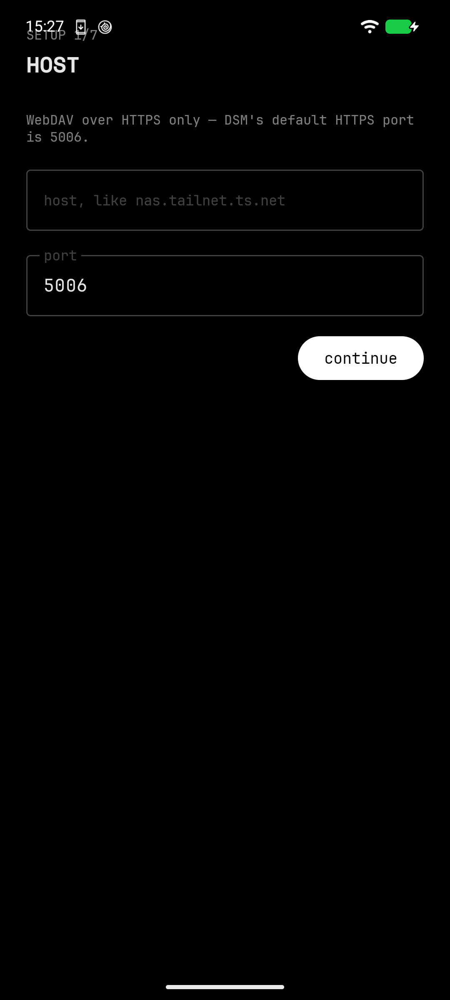

# XX-Note

> Delete this app and lose nothing — the notes were plain Markdown the whole time.

Google Keep's front end — card grid, one-tap capture, checklists, labels,
pin, archive, search — over a folder of `.md` files on hardware you own.
Every note is one plain file with YAML frontmatter. Open the vault in
Obsidian, in `vim`, in Notepad, in ten years.




**Spec:** [design.md](design.md) — the full design.
**Build plan:** [todo.md](todo.md) — workstreams, gates, and the order to do them in.
**Hardening:** [todo-hardening.md](todo-hardening.md) — the gap list between "tests are green" and "trust it with the only copy of your writing."
**Screens:** [design/xx-note-screens.html](design/xx-note-screens.html) — the mockup.
**Research:** [design/research.md](design/research.md) — sourced findings behind this spec.
**Backend:** [server/README.md](server/README.md) — the fabric server half.

---

## Status 🧪

WS0–WS10 and the hardening pass are implemented.

| Check | Command | Result |
|---|---|---|
| Unit tests | `./gradlew testDebugUnitTest :core:test` | **623 green, 0 failures**, 1 skipped (`HeicTranscodeRoboTest`, deliberate) — app 492, core 131 |
| Release build | `./gradlew :app:assembleRelease` | 3.8 MB unsigned APK, R8 minification on. No signing keys yet |
| Server | `cd server && go test ./...` | 19 tests green, stdlib only |

Built against SDK 35, `minSdk 31`. The test device is a Pixel 6 (`oriole`)
running GrapheneOS on Android 17.

### What is actually proven on the phone

The app installs, launches, and draws its setup screen without crashing. That
is the entire list. Sync has never run against a real server from this device:
the on-device database holds no notes, and the only thing in `shared_prefs` is
the synced theme — no credentials are stored, because none have been entered.
Everything under "The sync rule" below is proven by tests on a JVM, not by a
round trip to a NAS. Treat the server-backed half as unverified until it is
verified.

## What a note is

```markdown
---
id: 01J9F2K3M4N5P6Q7R8S9T0V1W2
title: Grocery list
created: 2026-08-23T10:04:12Z
updated: 2026-08-23T10:07:55Z
pinned: true
labels: [home, errands]
type: checklist
---

- [ ] oat milk
- [ ] coffee, the dark one
- [x] bin bags
```

That is the whole storage format. The filename is `<ulid>-<slug>.md` and is
cosmetic — identity is the `id`, so a note renamed in Obsidian is still the
same note. Attachments sit in `attachments/` under their own content hash
and are referenced by ordinary relative Markdown links.

## The sync rule

Sync is a truth table over three snapshots — what the server had at the last
agreement, what the phone has now, what the server has now — evaluated by a
pure function with no Android dependencies. First match wins.

| Local | Remote | What happens |
|---|---|---|
| clean | clean | nothing |
| edited | clean | push |
| clean | edited | pull |
| edited | edited | three-way merge; unmergeable → **two visible notes** |
| trashed | edited | the edit wins, the note comes back |
| edited | deleted | the edit wins, the note comes back |
| deleted | clean | moved to trash, never unlinked |

One invariant governs all of it, and it is tested as a property over every
row: **no sync outcome reduces the bytes you can still read.** Deletes
become trash. Conflicts become two notes named the way Synology Drive names
its own. There is no timestamp-based resolution anywhere in the app — not as
a fallback, not as a setting — because "newest wins" is how sync engines
lose an afternoon of writing without telling anyone.

## Where the notes live ⚙️

Two backends, one `RemoteFiles` port.

- **Today, in the app:** WebDAV to the Synology over Tailscale. This is what
  `SetupScreen` asks you for and what ships in the APK.
- **In this repo, not yet wired:** [`server/`](server/README.md) —
  `xxnote-server`, a single static Go binary (stdlib only, zero modules) that
  serves each estate user's notes as plain `.md` files under
  `<data>/users/<user_id>/vault/`, authenticated with estate fabric bearer
  tokens instead of NAS credentials. Its API mirrors the `RemoteFiles` port
  1:1, so adopting it is one new port implementation on the client. Its tests
  include a two-user isolation matrix that was verified to go red when the
  path choke point is disabled.

Either way the storage philosophy holds: a folder of `.md` files an operator
can `cat`. Only the transport and the auth change.

## About the network permission

The rest of the family makes a hard claim: no `INTERNET` permission, and you
can check the manifest yourself. **XX-Note cannot make that claim** — talking
to your own server requires the permission, and pretending otherwise would be
the first dishonest thing in this repo.

The honest version: one host, no third party. The app reaches exactly one
origin — your server at its Tailscale address. `OneHostInterceptor` pins
every request to the configured `scheme://host:port` with redirects disabled
and throws before a socket opens for anything else; the network security
config forbids cleartext everywhere and anchors TLS to the system store only
(no pinning, no user CAs, and deliberately no `<domain-config>` — the host is
chosen at runtime, so an entry there could never match). CI runs
`scripts/check-permissions.sh` against the merged manifest and
`scripts/check-deps.sh` against the release dependency set, and fails the
build on any drift. No analytics, no crash reporting, no ads, no Play
Services, no Firebase. On GrapheneOS the Network permission is visible and
revocable, and revoking it leaves you a fully working local notes app that
says so.

## Theme sync 🎨

XX-Launcher broadcasts `xx.launcher.THEME_CHANGED` with a theme name and a
resolved background ARGB; XX-Note's exported receiver persists the choice and
repaints. Eight presets: AMOLED Night, Graphite, Forest Night, Ocean Drift,
Burgundy, Paper, Mist, Custom. Contrast is derived from the background, so
the light grounds get dark text without a second broadcast. Verified live on
the Pixel 6 — repainted to Graphite (`#131316`) and back. The nine family
apps all speak this contract; set the theme once in the launcher and the
estate follows.

## What is not in v1

Reminders, the home-screen widget, the quick-settings tile, and
share-to-note are deferred with intent — the frontmatter reserves
`reminder:` so today's vaults stay forward-compatible. Collaboration,
drawings, rich text beyond Markdown, cloud accounts of any kind, and
end-to-end encryption of the vault are permanent non-goals, with reasons, in
[design.md §2](design.md).

## Family

Brand, tokens, and type come from
[piercingxx-branding](https://github.com/PiercingXX/piercingxx-branding).
AMOLED black, Signal white, Space Mono / JetBrains Mono. Same stack and
conventions as [XX-Phone](https://github.com/PiercingXX/xx-phone),
[Nope-Mode](https://github.com/PiercingXX/Nope-Mode), and the Launcher —
Compose here rather than Views, by the XX-Vitals precedent, because a live
Markdown editor is the case that argues for it.

Free and ad-free. Collects no personal data. Nothing this app sees goes
anywhere but your own server.
